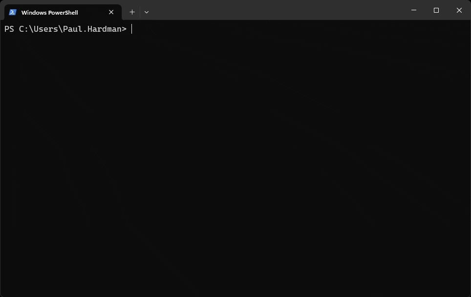

 # **LookingBusy - The Ultimate Fake Build Process**

Ever find yourself needing to look intensely busy when your boss strolls by, but you're actually waiting for inspiration (or the next coffee break)? Or maybe you just want to dazzle your coworkers with an impressive-looking build process? **LookingBusy** is here to save the day!

LookingBusy is a lighthearted app that fakes a build process, complete with progress bars, pseudo-technical lingo, and random status updates. It’s the ideal tool for keeping up appearances when you need a breather—or just want to have some fun at work.

## Demo




## **Key Features:**
- 🛠️ **Fake Builds**: Let LookingBusy simulate intricate and time-consuming build processes that look critical to your work.
- 📊 **Dynamic Progress Bars**: Keep your screen filled with convincing progress indicators, ensuring everyone around thinks you’re knee-deep in code.
- 💬 **Random Status Messages**: Enjoy fake technical updates like "Refactoring infinite loops..." or "Decrypting space-time fabric…".
- ⏳ **Adjustable Build Time**: Control how long you need to look busy—whether it's a quick distraction or an extended "deep focus" session.
- 😂 **Just for Fun**: LookingBusy is all about injecting some humor into your day. It won’t replace your real builds, but it’ll certainly keep you looking productive!

## **Perfect For:**
- Developers who need to appear busy in front of managers.
- Impressing non-technical colleagues with "complicated builds."
- Anyone who enjoys a good laugh while on the clock.


## Guide

to use

```
npm i lookingbusy
```

code accepts CL arguments as follows

```
npx lookingbusy --framework react
npx lookingbusy --framework vue
npx lookingbusy --framework angular
npx lookingbusy --framework svelte
```
